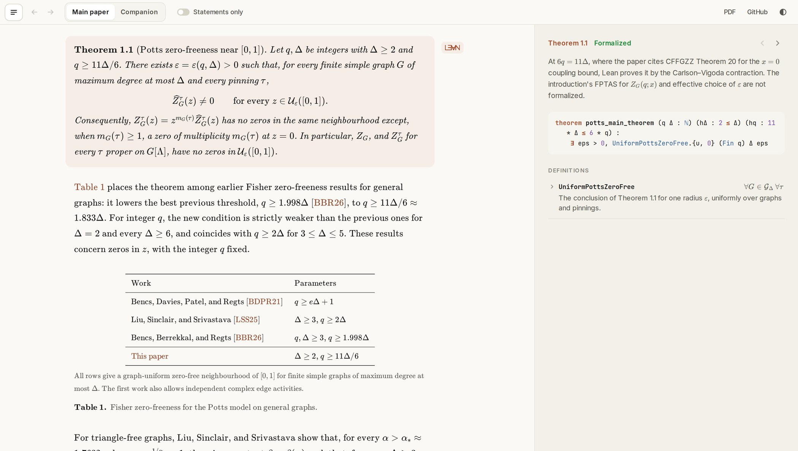

<div align="center">

# Coupling Independence Implies Zero-Freeness

**A Lean 4 formalization of both papers, readable side by side with its proofs**

### [Read the papers with their Lean →](https://keshih.github.io/coupling-independence-implies-zero-freeness/)

[Main paper (PDF)](docs/main.pdf) · [Companion (PDF)](docs/appendix.pdf) · [Proof overview](docs/overview.md)

</div>

[](https://keshih.github.io/coupling-independence-implies-zero-freeness/)

This repository formalizes, in Lean 4 with mathlib, two papers by Shuai Shao
and Ke Shi: *Coupling Independence Implies Zero-Freeness* (2026) and its
companion, *Further Potts Zero-Free Regions from Coupling Independence*.

- **Every numbered result.** Every numbered theorem, lemma, proposition and
  corollary of both papers has a Lean counterpart.
  [docs/coverage.json](docs/coverage.json) lists all 107 numbered statements,
  definitions and remarks included, with their status and Lean names.
- **No assumed literature.** The six cited ingredients that have standalone
  Lean statements are proved in the library, and no paper-facing theorem
  takes a literature hypothesis.
- **Standard axioms only.** The whole library depends only on Lean's
  `propext`, `Classical.choice` and `Quot.sound`.
- **Actual partition functions.** The headline statements concern finite
  partition functions. Potts pinnings are arbitrary partial colourings,
  improper ones included, and every zero-free radius is chosen before the
  graph, its size and the pinning.

## The website

The [**paper reader**](https://keshih.github.io/coupling-independence-implies-zero-freeness/)
shows both papers, rendered from their LaTeX, beside the Lean statement of
the result you are reading, the definitions it uses, and links to the exact
source lines. The ☰ button lists every section and statement (on wide
screens, beside the paper); switch to *Statements only* to skim every
numbered result with its Lean status. The ← → arrows step back and forward
through the references you follow, as in a PDF reader (⌘[ and ⌘] on a Mac,
Alt+← and Alt+→ elsewhere).

## The main theorem

For integers `Δ ≥ 2` and `q ≥ 11Δ/6`, one radius works for every graph of
maximum degree at most `Δ` (Theorem 1.1 of the paper; universe annotations
omitted):

```lean
theorem ZeroFreeness.Potts.potts_main_theorem (q Δ : ℕ) (hΔ : 2 ≤ Δ) (hq : 11 * Δ ≤ 6 * q) :
    ∃ eps > 0, UniformPottsZeroFree (Fin q) Δ eps

def ZeroFreeness.Potts.UniformPottsZeroFree (C : Type v) [Fintype C] (Δ : ℕ) (eps : ℝ) : Prop :=
  ∀ {V : Type u} [Fintype V] (G : SimpleGraph V),
    (∀ w, G.degree w ≤ Δ) → ∀ tau : PartialColouring V C,
    (∀ z ∈ thickening eps pottsInterval, normalizedPartition tau G z ≠ 0) ∧
    (∀ z ∈ thickening eps pottsInterval,
      fullPartition tau G z = 0 ↔ z = 0 ∧ 0 < tau.pinnedConflictCount G) ∧
    (fullPolynomial tau G).rootMultiplicity 0 = tau.pinnedConflictCount G
```

Here `pottsInterval` is `[0,1] ⊆ ℂ` and `thickening eps` is its open
`eps`-neighbourhood. The normalized pinned polynomial has no zeros there.
The ordinary pinned polynomial vanishes there only at `z = 0`, to order equal
to the number of monochromatic edges inside the pinned set, so not at all
when the pinning is proper. On the line `6q = 11Δ` the proof needs a
hard-colouring coupling bound, which the paper cites from Chen, Feng, Guo,
Zhang and Zou; Lean proves it with the Carlson–Vigoda contraction instead
(see below). `potts_main_strict` proves the case `11Δ < 6q` from the Vigoda
coupling alone.

## What is formalized

Theorem numbers follow the September 2026 versions of the two papers. Lean
names are relative to `ZeroFreeness`.

### Main paper

| Result | Lean |
| --- | --- |
| Thm 1.1: Potts zero-freeness near `[0,1]` for `q ≥ 11Δ/6` | `Potts.potts_main_theorem`, `Potts.potts_main_strict` |
| Thm 1.2: coupling independence implies zero-freeness on induced-subgraph-closed classes | `Potts.graph_class_potts_transfer_of_bounded` |
| Thm 4.1, Prop 4.10, Prop 4.12: the soft flip coupling and its conditional hard estimate | `Potts.root_strict_ci`, `conditionalHardCouplingEstimate`, `Potts.root_positive_ci` |
| Prop 5.1, Thm 5.2: Lee–Yang polydiscs for vertex-colour fields | `LeeYang.prop_field_transfer`, `LeeYang.near_vigoda_vertex_field_zero_free`, `LeeYang.cv_vertex_field_zero_free`, `LeeYang.high_girth_residual_original_field_transfer` |
| Cor 5.4: edge-colour fields for `q ≥ 3Δ` | `LeeYang.edge_lee_yang` |
| Thm 5.6, Cors 5.7 and 5.9: log-concave Holant problems, b-matchings and b-edge-covers | `Holant.exists_uniform_holant_polytube`, `Holant.bmatching_uniform_polytube`, `Holant.cor_bcover_short` |

### Companion: further Potts regimes

Each regime has a coupling-independence theorem and a zero-free theorem.
Girth conditions apply only to the free graph left after pinning.

| Regime | Coupling independence | Zero-freeness |
| --- | --- | --- |
| near-Vigoda: `Δ ≥ 2`, `q ≥ (11/6 − 1/84000)Δ` | `Appendix.near_vigoda_transfer_inputs` | `Appendix.near_vigoda_zero_free` |
| Carlson–Vigoda: `Δ ≥ 125`, `q ≥ 1.809Δ` | `Appendix.CV.root_coupling` | `Appendix.CV.zero_free` |
| large girth: `Δ ≥ 3`, `q ≥ Δ + 3` | `Appendix.Girth.high_girth_coupling` | `Appendix.Girth.high_girth_residual_original_zero_free` |
| high temperature: `q > 11(1 − x₀)Δ/6`, near `[x₀,1]` | `Appendix.high_temperature_graph_coupling` | `Appendix.high_temperature_zero_free` |
| BBR interval: `q ≥ 3`, `Δ/q ≥ (e − 1/2)/(e − 1)`, near `[BBR.start q Δ, 1]` | `Appendix.BBR.high_girth_coupling` | `Appendix.BBR.high_girth_residual_original_zero_free` |
| edge-Potts: `Δ ≥ 2`, `q ≥ 3Δ`, on line graphs | `Appendix.Edge.root_children_ci` | `Appendix.Edge.edge_potts_zero_free` |
| girth five: `0 < δ ≤ 1`, `Δ ≥ girthFiveCIThreshold δ`, `q ≥ (1 + δ)Δ` | `Appendix.Girth.girth_five_coupling` | `Appendix.Girth.girth_five_residual_original_zero_free` |

[docs/appendix/STATUS.md](docs/appendix/STATUS.md) gives the exact
hypotheses, constants and proof route of each regime, including where the
Lean proof differs from the written one.

### Coverage of the numbered statements

[docs/coverage.json](docs/coverage.json) has one entry for each of the 107
numbered statements of the two papers, 32 in the main paper and 75 in the
companion, with its status, the Lean declarations that state it, the
definitions needed to read them, and a note on any difference of form.
All Lean names elaborate. Each of the 92 theorems, lemmas,
propositions and corollaries has one of the three `formalized` statuses:

| Status | Entries | Meaning |
| --- | --- | --- |
| `formalized` | 77 | the Lean statement has the written strength (74 results and 3 remarks with mathematical content; the claims about cited work in those remarks are listed below) |
| `formalized-equivalent` | 16 | an equivalent form, for example on boundary-count data, with the bridge named in the note |
| `formalized-narrowed` | 2 | companion Lemmas 3.6 and 6.10, in the narrowed form the companion now states |
| `definition` | 8 | a Lean definition; the claims made inside the definition are proved, except the citation noted below |
| `remark` | 4 | a remark that makes no claim of its own: it describes the proof, or attributes or compares cited work |

<details>
<summary><b>What remains unformalized</b> (citation-level claims only)</summary>

Companion Lemma 6.10 is stated for the Potts family at positive activity
`x ∈ J ⊆ (0,1]`, the only case the companion uses, and the `k`-fold clause
of Lemma 3.6 counts labelled free–pinned edges. What remains unformalized
is citation-level:

- Remark 4.4 of the companion (`rem:critical-scope`) says that CFFGZZ
  Theorem 20 and Proposition 22 apply along the critical line. That claim
  about the cited paper is not formalized; Lean proves the same `x = 0`
  bound by the Carlson–Vigoda contraction
  (`Potts.critical_line_hard_endpoint`).
- Definition 5.3 of the companion (`def:cv-metric`) identifies the hard
  metric with Eq. (2) of Carlson and Vigoda (2024). That identification is
  not formalized. The hard metric `Appendix.CV.hardMetric`, the coefficient
  `(P₂ − P₃)/2 = 17/200` and the limit `d_x → d_hard` as `x ↓ 0` are.
- Cited background in remarks is not formalized: the Heilmann–Lieb
  theorem and Wagner's method in Remark 5.8 of the main paper
  (`rem:matching-degree-dependence`, whose star bound is proved), and the
  attributions and comparisons in the four `remark` entries.
- Algorithmic and FPTAS claims are outside the scope of a Lean statement,
  and the claim that `ε` can be chosen effectively is not formalized.

</details>

## Cited results proved in Lean

Six of the ingredients cited by the written proofs have standalone Lean
statements about actual finite Potts models, and each is proved in the
library. No paper-facing theorem takes one as a hypothesis.

<details>
<summary><b>The six results, their sources and their Lean proofs</b></summary>

| Cited result | Source | Lean theorem | File |
| --- | --- | --- | --- |
| Hard-colouring CI at `q = 11Δ/6` (Theorem 20) | Chen, Feng, Guo, Zhang, Zou, *Deterministic counting from coupling independence*, arXiv:2410.23225v2 | `Potts.critical_hard_colouring_input`, `Potts.external_critical_hard_colouring_theorem`, from `Appendix.CV.option_root_ci_critical` | `ZeroFreeness/Potts/Theorems/PottsExternalTheorem.lean`, `ZeroFreeness/Coupling/CV/RootCI.lean` |
| Tree influence–Jacobian identity (Lemma 8.7) | Chen, Liu, Mani, Moitra, *Strong spatial mixing for colorings on trees and its algorithmic applications*, arXiv:2304.01954v3 | `Appendix.Girth.CavityTree.clmmInfluenceIdentity` | `ZeroFreeness/Coupling/Girth/Tree/InfluenceIdentity.lean` |
| Sphere decay implies the coupling bound `2Δ^R` (Lemma 5.13) | same | `Appendix.CLMM.Lemma513.sphere_to_coupling` | `ZeroFreeness/Coupling/CLMM/SphereCoupling.lean` |
| Graph sphere estimate (Equation (10), from Lemmas 5.19 and 5.20) | same | `Appendix.CLMM.Eq10.sphere_estimate_proof`, packaged as `Appendix.CLMM.literature` | `ZeroFreeness/Coupling/CLMM/SphereEstimate.lean` |
| Squared-norm contraction of the square-root recursion (Theorem 2.5) | Bencs, Berrekkal, Regts, *Near optimal bounds for weak and strong spatial mixing for the anti-ferromagnetic Potts model on trees*, Electron. J. Probab. 30 (2025) | `Appendix.BBR.theorem_2_5_holds` | `ZeroFreeness/Coupling/BBR/Theorem25.lean` |
| Segment-weight bound (Proposition 2.6(i)) | same | `Appendix.BBR.proposition_2_6_i_holds`, packaged with Theorem 2.5 as `Appendix.BBR.literature` | `ZeroFreeness/Coupling/BBR/Proposition26.lean` |

The main theorem uses the first result at `q = 11Δ/6`, and near-Vigoda
uses it at the twenty pairs `(Δ,q) = (6j,11j)`, `j ≤ 20`. The large-girth
regime uses the three CLMM results, the BBR interval uses both BBR results
with CLMM Lemma 5.13 and Eq. (10), and girth five uses CLMM Lemma 5.13.
Lee–Yang regimes (i) and (iii) use the same results as near-Vigoda and large
girth. No other result in the tables uses any of them.

The statements remain as named propositions,
`Potts.ExternalCriticalHardColouringTheorem`,
`Appendix.Girth.CavityTree.CLMMInfluenceIdentity`, `Appendix.CLMM.Literature`
and `Appendix.BBR.Literature`, but no paper-facing theorem takes one as a
hypothesis. Only the conversion
`Potts.ExternalCriticalHardColouringTheorem.to_normalizedInput`,
`Potts.potts_zero_free_from_external` and
`Potts.critical_potts_zero_free_from_external`, which keep the paper's
cited route for comparison, take `ExternalCriticalHardColouringTheorem` as
a premise, and that premise is proved. Three Lean proofs take a different
route from the cited one. The critical line uses the Carlson–Vigoda
contraction, extended to `Δ ≥ 6`, `q ≥ 11Δ/6`, instead of the CFFGZZ proof.
Proposition 2.6(i) replaces BBR's Lemmas 4.1 and 4.2(i) by two uses of the
concavity of `log`. The induction for Lemma 5.13 uses `1 + log ℓ` in place
of harmonic numbers. [docs/external-inputs.md](docs/external-inputs.md)
records each statement and its proof.

</details>

## Build and verify

Requires [elan](https://github.com/leanprover/elan). `lean-toolchain` pins
Lean 4.33.1 and `lakefile.toml` pins mathlib v4.33.1.

```bash
lake exe cache get
LEAN_NUM_THREADS=2 bash scripts/check-all.sh
```

`check-all.sh` builds the library with warnings treated as errors, then
checks the transitive axioms of every project declaration. A successful
run ends with

```text
Build completed successfully (4066 jobs).
Complete-library axiom audit passed: 11313 declarations; allowed dependencies used: [propext,
 Classical.choice,
 Quot.sound]
```

`scripts/check.sh` checks only the main paper and `scripts/check-appendix.sh`
only the companion. [docs/verification.json](docs/verification.json) records
the checked sources, their SHA-256 hashes and the last full run.

## Updating the website

The site is served from `docs/` by GitHub Pages. The reader needs no Lean
build:

```bash
pip install pymupdf
python3 scripts/site/build_reader.py
```

`scripts/site/build_reader.py` renders the LaTeX in `paper/` into
`docs/index.html`. It numbers statements, equations and sections as LaTeX
does, and stops if a statement differs from `docs/coverage.json` or a
number differs from the hyperref destinations in the PDFs. Figures and
commutative diagrams are drawn from their TikZ source; one it cannot read
is cut from the PDF instead. To publish a new version of a paper, replace
its folder in `paper/` and its PDF in `docs/`, then rerun the script.

## Layout

| Path | Contents |
| --- | --- |
| `ZeroFreeness/Analysis/` | complex averages, analytic logarithms, local stability |
| `ZeroFreeness/Coupling/` | the couplings: Vigoda flips, Carlson–Vigoda, edge-Potts, high temperature, large girth, BBR, girth five; the proofs of the cited CLMM and BBR results |
| `ZeroFreeness/Potts/` | Potts models, pinnings and separators, the transfer theorem, the main theorems and the companion's regimes |
| `ZeroFreeness/LeeYang/` | colour-field partition functions and zero-free polydiscs |
| `ZeroFreeness/Holant/` | log-concave Holant models and their applications |
| `audit/` | axiom audits, kept outside the library |
| `docs/` | the website, both papers as PDFs, proof guides, per-result status and the verification record |
| `paper/` | LaTeX sources of both papers, with their ancillary verifier scripts |

`ZeroFreeness.lean` imports the whole library. To read the proofs, start with the
[documentation index](docs/README.md) or the [proof overview](docs/overview.md).

The formalization was developed with assistance from GPT-6 Astra and Claude
Opus 5.5, as disclosed in both papers.
